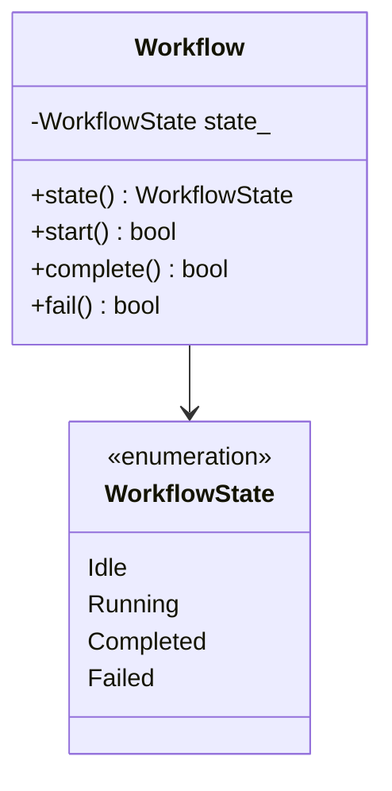
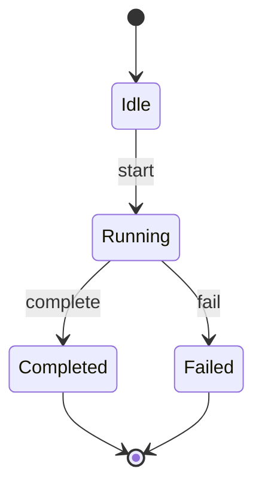

# Reference workflow diagrams

## Class diagram

```mermaid
classDiagram
    class Workflow {
        -WorkflowState state_
        +state() WorkflowState
        +start() bool
        +complete() bool
        +fail() bool
    }

    class WorkflowState {
        <<enumeration>>
        Idle
        Running
        Completed
        Failed
    }

    Workflow --> WorkflowState
```

## State diagram

```mermaid
stateDiagram-v2
    [*] --> Idle
    Idle --> Running: start
    Running --> Completed: complete
    Running --> Failed: fail
    Completed --> [*]
    Failed --> [*]
```
